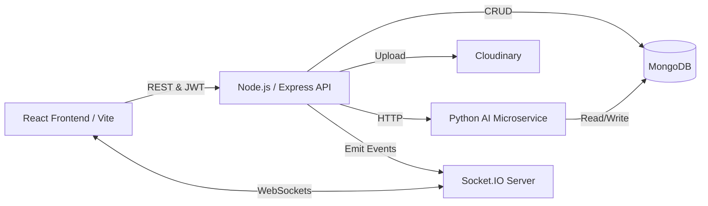

# AI-Driven Social Media Platform

**Intelligent Content Moderation, Real-Time Messaging & Personalized Recommendation System**


A full-stack, real-time social media platform integrating advanced Natural Language Processing (NLP), Graph Neural Networks (GNN), and Explainable AI (XAI) to demonstrate intelligent content safety, bot detection, and user engagement. 

Built as an academic and engineering showcase of integrating complex machine learning pipelines into a scalable web application.

## Table of Contents
- [Overview & Problem Statement](#overview--problem-statement)
- [Key Features](#key-features)
- [System Architecture](#system-architecture)
- [Content Moderation Pipeline](#content-moderation-pipeline)
- [Explainable AI (XAI)](#explainable-ai-xai)
- [Visual / NSFW Moderation](#visual--nsfw-moderation)
- [GNN Bot Detection & Scientific Validation](#gnn-bot-detection--scientific-validation)
- [Recommendation System](#recommendation-system)
- [Real-Time Architecture](#real-time-architecture)
- [Authentication & Security](#authentication--security)
- [Media Pipeline](#media-pipeline)
- [Technology Stack](#technology-stack)
- [Installation & Local Development](#installation--local-development)
- [Production Deployment](#production-deployment)
- [Known Limitations](#known-limitations)

---

## Overview & Problem Statement

Traditional social platforms struggle to balance user-generated content, scalable moderation, personalized discovery, and real-time interactions without sacrificing transparency. 

This project explores an integrated solution by combining a real-time web application with a multi-model AI microservice. It tackles:
- **Scalable Safety:** Asynchronous AI moderation for text, images, and video frames.
- **Transparency:** Token-level Explainable AI (XAI) to interpret moderation decisions.
- **Integrity:** Graph Neural Network (GNN) based behavioral analysis for bot detection.
- **Discovery:** Hybrid recommendation engines blending collaborative filtering, content similarity, and recency.

---

## Key Features

### Social & Real-Time Features
- **User Ecosystem:** Registration, profiles, follow/unfollow, and public/private account toggles.
- **Content Creation:** Posts with images/videos, comments, likes, saves, and shares.
- **Real-Time Messaging:** Socket.io-powered 1-on-1 chat with typing indicators, read receipts, and media/sticker support.
- **Notifications:** Real-time push notifications for interactions.

### AI Safety & Moderation
- **Multilingual Toxicity:** Dynamic language routing (English vs. Non-English) for hate-speech and toxicity detection.
- **Visual Moderation:** Image and sampled-frame video NSFW detection.
- **Asynchronous Pipeline:** Configurable threshold-based state transitions (Pending → Published / Flagged / Rejected).

### Explainability & Analytics
- **Token Attribution:** Gradient × Input XAI for text moderation, visualizing exactly which words triggered a safety threshold.
- **Admin Dashboard:** Centralized UI for reviewing flagged content, viewing XAI highlights, and running on-demand bot scans.

---

## System Architecture



---

## Content Moderation Pipeline

When a user creates content, it enters an asynchronous, fail-safe moderation pipeline:

1. **Submission:** Content is saved to MongoDB in a `pending` state.
2. **Language Routing:** The Python service identifies the language.
3. **Inference:** Text is passed to toxicity models; Media is passed to NSFW models.
4. **Decision:** 
   - `≤ 0.70` → Publish
   - `> 0.70 and ≤ 0.90` → Flag for Admin Review
   - `> 0.90` → Reject
5. **Real-time Update:** Socket.IO notifies the frontend of the state change.

### AI Models Utilized
- **Language Detection:** `papluca/xlm-roberta-base-language-detection`
- **English Toxicity:** `Emmytheo/Deberta-v3-finetuned-hate-speech-jigsaw-toxic-comments` (6 categories)
- **Multilingual Toxicity:** `unitary/multilingual-toxic-xlm-roberta`
- **Sentiment Analysis:** `distilbert-base-multilingual-cased-sentiments-student`

*(Note: Thresholds are project-configured bounds, not universal safety standards.)*

---

## Explainable AI (XAI)

To provide transparency into moderation rejections, the platform implements **Gradient × Input** attribution.

- **Mechanism:** Computes the gradient of the predicted toxicity category with respect to the input embeddings ($G = \partial output / \partial E$), yielding the attribution score $S = ||G \odot E||_2$.
- **Granularity:** Uses subword aggregation (SentencePiece/WordPiece) to extract **token-level attribution**.
- **Output:** The top 5 highly attributed tokens are persisted in MongoDB and visualized in the Admin UI.

**Validation Sanity Check:** In tested examples, masking highly attributed tokens resulted in massive drops in predicted toxicity (e.g., $0.94 \to 0.0003$), providing evidence that the attribution rankings are behaviorally informative. *(Note: Attribution is not causal proof.)*

---

## Visual / NSFW Moderation

- **Images:** Processed via `Falconsai/nsfw_image_detection`.
- **Videos:** OpenCV is used to extract **5 evenly spaced frames** from the video buffer. A rejection rule is applied based on the proportion of these sampled frames exceeding the NSFW threshold.

---

## GNN Bot Detection & Scientific Validation

To combat automated abuse, the platform implements an offline/online bot detection module using a **GraphSAGE** architecture and a Random Forest baseline, optimizing via `BCEWithLogitsLoss`.

- **Topology:** Constructs a directed user-user graph utilizing follow, like, and comment edges. Extracts a 2-hop ego graph bounded by maximum neighbors for inference.

### Scientific Validation & Limitations
Because the real development database lacked sufficient class diversity (9 users, no weak positive bots), real-data predictive validation was blocked. A controlled synthetic evaluation was performed:

- **Dataset:** 2,000 users (1,600 human, 400 bot), 146,810 edges.
- **Weak Labels:** 20 positive, 1,727 negative, 253 uncertain/excluded.

**Results:**
- **Random Forest:** weak-label F1 = 1.0000; hidden ground-truth F1 = 0.2000.
- **GraphSAGE:** weak-label F1 = 1.0000; hidden ground-truth F1 = 0.2000.
- **Shuffled-edge GraphSAGE:** F1 = 1.0000 against weak labels.

**Conclusion:** The weak-labeler had poor coverage of the synthetic bot population. The implemented GraphSAGE configuration did not demonstrate measurable predictive improvement over the Random Forest baseline in this controlled evaluation, and the shuffled-edge result indicates that graph topology did not provide measurable lift under the tested configuration.

---

## Recommendation System

The feed utilizes a **Hybrid Recommendation Engine** blending five normalized components:

1. **Content Score (α = 0.25):** TF-IDF-inspired cosine similarity between a user's interest profile (aggregated from liked posts) and candidate post content.
2. **Collaborative Score (β = 0.25):** User-based collaborative filtering computing the mean Jaccard similarity among likers.
3. **Engagement Score (γ = 0.20):** Normalized total engagements.
4. **Recency Score (δ = 0.20):** Exponential time decay.
5. **Sentiment Score (ε = 0.10):** Minor boost for positive sentiment.

Followed-user posts receive an explicit boost, and a deterministic random jitter ensures feeds remain dynamic on subsequent refreshes.

---

## Real-Time Architecture

**Socket.IO** drives the real-time layer:
- **Chat:** `message:new`, `message:delivered`, `message:read`, `typing:start`, `typing:stop`
- **Presence:** `user:online`, `user:offline`
- **Moderation:** Pushes async moderation completion updates to the client.

---

## Authentication & Security

- **Auth:** JWT-based stateless authentication with hashed passwords (`bcryptjs`).
- **Authorization:** strict Role-Based Access Control (RBAC) separating `user` and `admin` routes.
- **Media Security:** MIME/magic-byte validation and strict upload size limits.

---

## Media Pipeline

```
User → Node.js API → Cloudinary → MongoDB (URL) → AI Moderation → Frontend
```
Uses `multer-storage-cloudinary` for direct, scalable media storage, accepting images, audio clips, and videos.

---

## Technology Stack

- **Frontend:** React 19, Vite, React Router, Socket.io-client, Axios
- **Backend:** Node.js, Express 4, Mongoose ODM, Socket.io, Cloudinary
- **AI Service:** Python 3.11, Flask, PyTorch, HuggingFace Transformers, scikit-learn
- **Database:** MongoDB 7

---

## Installation & Local Development

### Prerequisites
- Node.js 20+
- Python 3.10+
- MongoDB 7+ (running locally)
- Cloudinary Account & Gmail App Password (for SMTP)

### Setup

```bash
# 1. Clone repository
git clone <repository-url>
cd ai-social-platform

# 2. Setup Backend
cd backend
npm install
cp ../.env.example .env # Configure MongoDB, Cloudinary, SMTP
npm run dev

# 3. Setup AI Service
cd ../services/ai-service
pip install -r requirements.txt
cp ../../.env.example .env
python run.py # (Downloads models on first run)

# 4. Setup Frontend
cd ../../frontend
npm install
npm run dev
```

*(Optional) Seed realistic demo data:*
`cd backend && npm run seed:realistic-50`

---

## Production Deployment

- **Backend / AI (EC2/VPS):** Utilize the provided `docker-compose.yml` to containerize the Node and Python services.
- **Frontend (Vercel/Netlify):** Deploy the `/frontend` directory as a static SPA, ensuring `VITE_API_URL` points to the deployed backend.

---

## Known Limitations

- **Multilingual Support:** Multilingual routing is implemented and tested on representative examples, but universal language coverage is not guaranteed.
- **Bot Detection:** Graph topology relies on a bounded 2-hop extraction; current validation limits its use to an advisory/admin-review tool rather than a fully autonomous banning agent.
- **Video Moderation:** Relies on discrete sampled frames rather than continuous spatio-temporal video understanding.

---

## License

This project is developed for academic purposes. Licensed under the MIT License.
